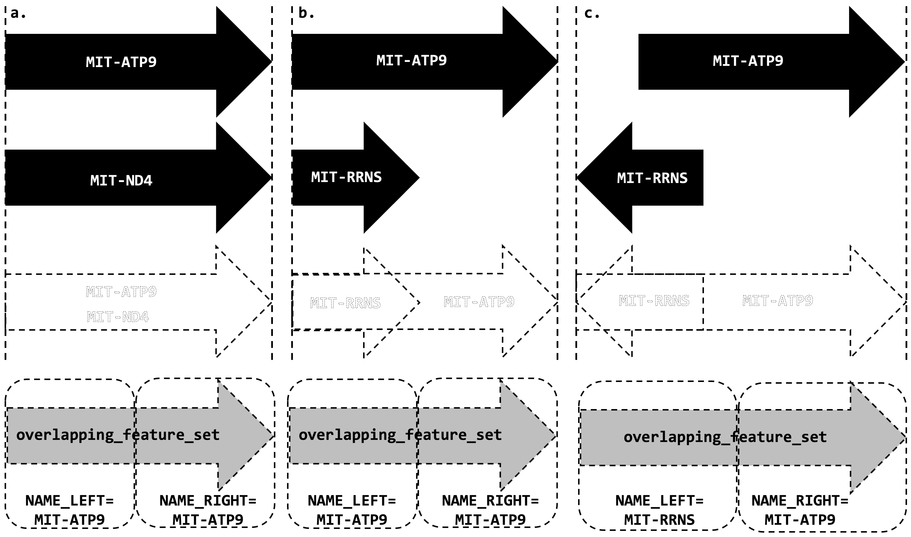

# `tigre clean`

`tigre clean` performs several preparatory steps to standardize the GFF3 files for downstream analyses.

Two fundamental preparatory steps are handling bondaries of circular genomes, and resolving overlapping features. These steps are essential because overlapping annotations and/or circular genomes can make it tricky (computationally) to identify and extract intergenic regions.

## Features that span the genome boundary

Sometimes features span the "boundary" of a circular genome, meaning they begin before the genome end coordinate, and extend beyond the genome start coordinate.
These boundary-spanning features present a computational challenge for downstream analyses.

In such cases, `tigre clean` breaks these features into two parts: one at the end of the genome and one at the start genome, appending their type with "_fragment". This ensures that intergenic regions are correctly identified even when features cross the genome boundary.

To resolve this challenge, tigre clean splits each boundary-spanning feature into two separate annotations, appending `_fragment` to their GFF3 feature type. The splitting is done as follows:

 - First fragment: Spans from the original feature start coordinate until the end of the genome
 - Second fragment: Spands from the genome start (coordinate 1) to the original feature end position minus the genome size

Both fragments retain all the original feature's attributes. This splitting strategy simpliflies subsequent steps by allowing them to initially treat a circular genome as linear, and dealing with the circularity only when processing regions around the genome boundary.

## Overlapping Features

If `tigre clean` detects that multiple features overlap one another, the `clean` command creates a new feature type called `overlapping_feature_set`. This special feature marks regions where no valid intergenic sequence can exist due to feature overlap.

The `overlapping_feature_set` is generated by merging all overlapping features into one consolidated annotation. Its strand is always set to `+`, since it represents a combined (meta)region rather than a feature on a specific strand.

To preserve context for downstream analyses, the `overlapping_feature_set` stores the identifying information (i.e., gene name) only of the features at the boundaries of the overlapping region. These boundary features are used to determine the upstream and downstream delimiters of the adjacent intergenic regions.

The attributes of the `overlapping_feature_set` include:
 - `name_left`: Retrieved from the `ID=` value in the attribute column (or the standardized GDT gene name) of the feature that starts at the left boundary of the overlap region.
 - `source_left`: Custom value built using the original feature information in the following format: `seqid|type|start|end|strand|ID=;`
 - `name_right`: Retrieved from the `ID=` value in the attribute column (or the standardized GDT gene name) of the feature that ends at the right boundary of the overlap region.
 - `source_right`: Custom value built using the original feature information in the following format: `seqid|type|start|end|strand|ID=;`

If there are multiple features that start or end at the overlap region boundaries, `tigre clean` uses the following rules to select which features to pick as left and right boundary features:

- Left: Choose the feature with the lowest start coordinate. If there is a tie, select the feature with the highest end coordinate.
- Right: Choose the feature with the highest end coordinate. If there is a tie, select the feature with the lowest start coordinate.

If two features have identical start and end coordinates, the one that appears first in the GFF3 file is chosen.

There are a few possible scenarios for overlapping features, described in the image below:

  

Figure: Overlapping feature scenarios handled by `tigre clean`.
The figure illustrates three hypothetical overlapping feature scenarios and how they are resolved into overlapping_feature_set annotations:

 - a. This scenario shows a case where two features (MIT-ATP9 and MIT-ND4) have the exact same start and end coordinates, meaning they completely overlap. 
 As `tigre` does not correct annotations, the algorithm arbitrarily picks the first feature listed in the GFF3 for the boundary information. The resulting `overlapping_feature_set` will coincide with the chosen feature.

 - b. Overlap between a larger feature (MIT-ATP9) and smaller feature (MIT-RRNS) that have the same start coordinate. The resolution for the left boundary falls in the tie break rule: in this case MIT-ATP9 the chosen as the left boundary feature. For the right side, MIT-ATP9 is also the chosen feature because it is the only feature that ends at the right boundary of the overlap region.

 - c. Regular overlap between MIT-RRNS and MIT-ATP9. The merged region becomes an `overlapping_feature_set` with boundary features determined by the selection rules (lowest start coordinate for left boundary, highest end coordinate for right boundary). Note that the strand of the `overlapping_feature_set` is always set to `+`, regardless of the strands of the original features.

# `tigre extract`

`tigre extract` is the command that extracts intergenic regions from the GFF3 file, using the annotations processed by `tigre clean`.

> [!NOTE]
> We always refer an interving region as "intergenic region", but the user can customize the feature type used to represent these regions in the output by providing a value for the flag `--feature-type` (default as `intergenic_region`).

`tigre extract` expects GFF3 files containing fully independent features, meaning that overlapping and boundary-spanning features have been resolved. All features are sorted by their start coordinate and their attributes are standardized using the format `name=value;source=value;` (for `overlapping_feature_set`, we expect `name_left=value;source_left=value;name_right=value;source_right=value;`).

## Identifying intergenic regions
The core algorithm identifies intervals between consecutive features and creates intergenic region annotations for these intervals. Each intergenic region is defined as the sequence between the end of one feature and the start of the next feature. Therefore their start coordinate is one position after the end of the upstream (left) feature, and their end coordinate is one position before the start of the downstream (right) feature.

Each intergenic region captures information about its flanking features in its attributes:
- `name_up` and `source_up`: Identifying information from the upstream flanking feature.
- `name_dw` and `source_dw`: Identifying information from the downstream flanking feature.

## Genome boundary handling
`tigre extract` handles genome boundary with special logic to ensure that intergenic regions, and their corresponding flanking features, at the start and end of the genome are correctly identified, especially for circular genomes.

### Start boundary regions
If the first feature in the genome does not start at coordinate 1, an intergenic region is created from position 1 up to the start of the first feature. For this boundary region:

 - `name_up` and `source_up` are derived from the last feature if the genome is circular, or set as `region_start` if linear.
 - `name_dw` and `source_dw` are derived from the first feature.

### End boundary regions
If the last feature does not end at the genome's final coordinate, an intergenic region is created from the end of the last feature to the genome end. For this boundary region:

 - `name_up` and `source_up` are derived from the last feature.
 - `name_dw` and `source_dw` are derived from first feature if the genome is circular, or set as `region_end` if linear.

### Circular genome boundary merging
For circular genomes (identified by the presence of `is_circular=true` in the attributes for the region feature), `tigre extract` performs an additional check for boundary merging.
If both a start boundary region and an end boundary region were to be created (meaning the first feature starts after coordinate 1 AND the last feature ends before the genome end), single intergenic region that spans across the genome boundary is created.

This boundary region:
 - Spans from the end of the last feature, wraps around the genome boundary, and continues to the start of the first feature.
 - Has its feature type appended with `_merged` to indicate it crosses the genome boundary.
 - Uses `name_up`/`source_up` from the last feature and `name_dw`/`source_dw` from the first feature.

The merging logic recognizes that in circular genomes, the space at the end of the genome and the space at the start of the genome actually form a single continuous intergenic region.

  

Figure: Intergenic region extraction scenarios in circular genomes using `tigre extract`.
A simplified (circular-mapping) mitochondrial genome is shown on the left. The inset depicts the genome boundary delimited by MIT-ATP6 and MIT-RPL16 in different configurations. The linear representations (a-d) illustrate different extraction scenarios:
 - a. Boundary merging scenario: When both start and end boundary regions would be created (first gene starts after coordinate 1 AND last gene ends before genome end), a single merged intergenic region is created that spans across the genome boundary. The region is annotated as intergenic_region_merged with `name_up`/`source_up` from the last feature (ATP6) and `name_dw`/`source_dw` from the first feature (RPL16).
 - b. End boundary region: Intergenic region created from the last gene to the genome end, when the last gene does not end right at the genome end. For circular genomes, `name_dw`/`source_dw` is derived from the first feature (RPL16).
 - c. Start boundary region: Intergenic region created from position 1 to the start of the first feature, when the first gene does not start at coordinate 1. For circular genomes, `name_up`/`source_up` is derived from the last feature (ATP6).
 - d. Boundary-spanning feature handling: Shows how features that cross the genome boundary are split into fragments in `tigre clean` (with `_fragment` appended to their type). In this case the nth intergenic region's `name_dw`/`source_dw` and the first intergenic region's `name_up`/`source_up` are derived from the fragments (and therefore the original annotation) of MIT-ATP6.

## Output structure
Each extracted intergenic region follows standard GFF3 format with:

 - Feature type: `intergenic_region` as default (customizable), or `intergenic_region_merged` for boundary-spanning regions in circular genomes.
 - Strand: Always `+` since intergenic regions are not strand-specific. The strandedness of the flanking features is stored in the attributes of the corresponding intergenic region (in the fields `source_up` and `source_dw`).
 - Attributes: Include upstream and downstream feature information as described above, plus a unique ID in the format `{seqid}_{feature_type}_{counter}`.

# Experimental Intron Extraction

TIGRE can be used (experimentally) to extract intronic regions through an iterative implementation of `tigre clean` and `tigre extract`, along with the help of `tigre combine`. With a few tweaks in the original behaviour of TIGRE (see details below), this approach redirects TIGRE's "gap-finding" strategy to identify intronic rather than intergenic regions. Note that, in our context, "gap" means regions of the genome that are not annotated. The lack of annotation can come from the original .gff3 file or from the way that the filtering of `tigre clean` is customized. The word "gap" here should not be confounded with the usual "gaps" in multiple sequence alignments.  

By iterating through `tigre clean` and `tigre extract`, one can remove potential intronic regions because we are considering introns to be "voids" - i.e, gene regions that are not occupied by exons or coding sequences (CDS). Note that this approach is only experimental and it has clear limitations (see Limitations and Considerations below). The main issue is the possibility of annotating a non-intronic region (e.g., 5' UTR) as intron, given our "by exclusion" definition of introns. Accuracy of the final results will rely heavily on the quality of the original annotation.

## Multi-Step Process

### Step 1: Initial Intergenic Extraction
The process begins with the standard approach of TIGRE to extract all intergenic regions from the original genome annotations:

1. **Clean the input**: `tigre clean` processes the original GFF3 files to resolve overlaps and boundary-spanning features.
2. **Extract intergenic regions**: `tigre extract` identifies all "gaps" between annotated features and creates `intergenic_region` annotations.

At this stage, the extracted regions represent true intergenic spaces - areas between genes where no annotation previously existed. Note that, prior to extracting the intergenic regions, the user has the flexibility to keep (or remove) ORFs that are oftentimes annotated in these intergenic regions (see Options under `tigre clean` in [README](README.md#tigre-clean)). 

### Step 2: Annotation Merger
The original GFF3 files are combined with their corresponding intergenic GFF3 files using `tigre combine`. This creates "_combined.gff3" files containing:

- All original genomic features (genes, CDS, exons, tRNAs, etc.).
- The newly extracted intergenic regions.

The result is a "complete"/"combined" genome annotation where every nucleotide position is now covered by some type of feature - either an original annotation or an intergenic region.

### Step 3: Strategic Feature Filtering and Re-extraction
The combined files undergo a second round of processing with a strategic feature filtering:

1. **Selective cleaning**: `tigre clean` processes the combined files, but with an important modification - the `--query-string` parameter is used to retain only specific feature types:
   - `region`: Genome sequence boundaries.
   - `exon` and `CDS`: Protein-coding sequences within genes.
   - `intergenic_region` and `intergenic_region_merged`: Previously identified intergenic spaces.

   Importantly, gene annotations are **excluded** from this filtering step.

2. **Intronic extraction**: `tigre extract` now operates on a modified annotation file where:
   - Intergenic regions occupy the spaces between genes (from Step 1).
   - CDS and exon features occupy the coding portions within genes.
   - Spaces between CDS/exons are empty, creating "voids" within the original gene annotations.

`tigre extract` identifies these intra-gene voids between CDS/exon features, effectively capturing (possible) intronic sequences.

  

Figure. Workflow of the advanced usage of TIGRE for the extraction of intronic regions.
 - a. The original `<AN>.gff3` file is processed by `tigre clean` and `tigre extract` (1) to generate `<AN>_intergenic.gff3`, just as the usual TIGRE pipeline. 
 - b. `<AN>.gff3` and `<AN>_intergenic.gff3` are merged via `tigre combine` (2). Note that, at this stage, every nucleotide is encapsulated in at least one annotation type (intergenic, CDS, gene, etc).
 - c. `<AN>_combined.gff3` is processed by `tigre clean`, generating `<AN>_clean_to_intron.gff3` (3).
 - d. `<AN>_clean_to_intron.gff3` serves as input for `tigre extract` for the extraction of (potential) intronic regions (4). 

This diagram depicts the mitochondrial genome of Lachancea dasiensis CBS 10888 (Fungi) - Accession number: HE983611.1. The original annotation already contained introns (inside the cox1 gene) that served as benchmark to demonstrate the accuracy of the final results. This experimental advanced usage of TIGRE produces only potential intronic regions (hence the region names as "maybe_introns"). See Limitations and Considerations below for details on how to interpret these results. Genome maps were generated via [Geneious Prime](https://geneious.com) (R) 2023.2.1.

## Output Characteristics

The extracted intronic regions are annotated with a customizable feature type (set by `--feature-type "maybe_intron"` in the example) and follow the same attribute structure as intergenic regions:

- `name_up`/`source_up`: Information from the upstream flanking feature (typically a CDS or exon)
- `name_dw`/`source_dw`: Information from the downstream flanking feature (typically a CDS or exon)
- Strand: Always `+` (strand information of flanking features is preserved in attributes)

## Limitations and Considerations

This experimental approach has the following limitations:

1. **Accuracy depends on annotation quality**: The method can only identify introns in regions where gene boundaries and CDS/exon features are correctly annotated in the original GFF3 file.

2. **Alternative splicing complexity**: The cases have not been tested in this advanced use of TIGRE of alternative splicing or complex gene structures, the method may not capture all possible intronic variants.

3. **Pseudo-introns**: This "approach by exclusion" may identify regions as "introns" that are actually erroneous gaps in annotation rather than true intronic sequences. "Erroneous gaps" can refer both to a gap caused by an actual mistake in the original annotation or a gap created by the filtering criteria defined in --query-string. In both scenarios, this approach would classify (by exclusion) a non-intron as intron.

4. **Feature type dependency**: The success of the extraction depends on the consistency of feature type naming in the input GFF3 files.

5. **Intronic proteins (such as maturases and endonucleases)**: In cases where maturases, laglidadg endonucleases, or other similar proteins are encoded within introns, their CDS annotations will interfere with "proper" intron extraction. These proteins are typically encoded by open reading frames located within the intronic sequences of other genes. When their CDS features are retained in the Selective cleaning step, they "force the splitting" of intronic regions into multiple fragments. In such cases, users can manually check/remove the CDS and gene annotations of these intronic proteins from the `<AN>_clean_to_introns.gff3` files and re-run `tigre extract`. 